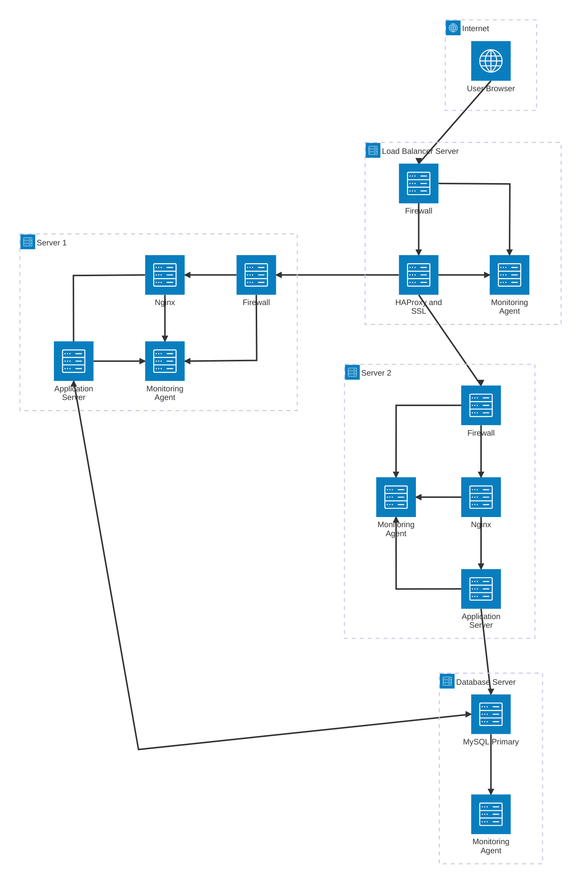

---

# Why each additional element exists

## Firewalls (3 total)

- Firewalls are added to control and restrict network traffic.
- Each firewall:
  - allows only required ports (e.g. 443, 3306 internally)
  - blocks unauthorized access
  - limits attack surface

### Example

- Load balancer firewall: only allow HTTPS (443)
- App servers: only allow traffic from LB
- Database: only allow traffic from app servers

# SSL certificate (HTTPS)

## HTTPS is used to

- encrypt traffic between users and the server
- prevent data interception (MITM attacks)
- protect credentials, cookies, tokens
- ensure authenticity of <www.foobar.com>

### Without HTTPS

- passwords can be sniffed
- sessions can be hijacked
- traffic can be modified

# monitoring agents (3)

Monitoring agents collect:

- CPU usage
- memory usage
- disk I/O
- network traffic
- application logs
- error rates

They send data to a centralized monitoring service (e.g. Sumologic, Datadog, Prometheus).

## What monitoring is used for

Monitoring is used to:

- detect outages
- identify performance issues
- observe traffic spikes
- alert engineers before users complain
- analyze historical trends

# How monitoring collects data

Monitoring agents:

- run on each server
- collect metrics locally
- tail logs
- push data periodically to a monitoring backend
- This is agent-based monitoring.

# How to monitor Web Server QPS

To monitor QPS (Queries Per Second) on Nginx:

- enable Nginx status module (stub_status)
- or parse access logs
- or expose metrics to Prometheus
- visualize QPS in dashboards

This helps detect:

- traffic spikes
- DDoS
- scaling needs
- 3️⃣ Issues with this infrastructure

# SSL termination at the Load Balancer

Problem:

- traffic between LB and backend is unencrypted
- internal attackers could sniff traffic
- violates end-to-end encryption

Better solution:

- re-encrypt traffic from LB to backend
- or use mutual TLS

# Only one MySQL Primary

Problem:

- single point of failure
- if MySQL crashes → writes stop
- no automatic failover

This affects:

- availability
- write scalability
- reliability

# Servers contain all components

Each server has:

- web server
- application server
- database

Problems:

- hard to scale components independently
- security risk (DB exposed on app server)
- inefficient resource usage
- harder maintenance

Best practice:

- separate concerns (web, app, DB)
