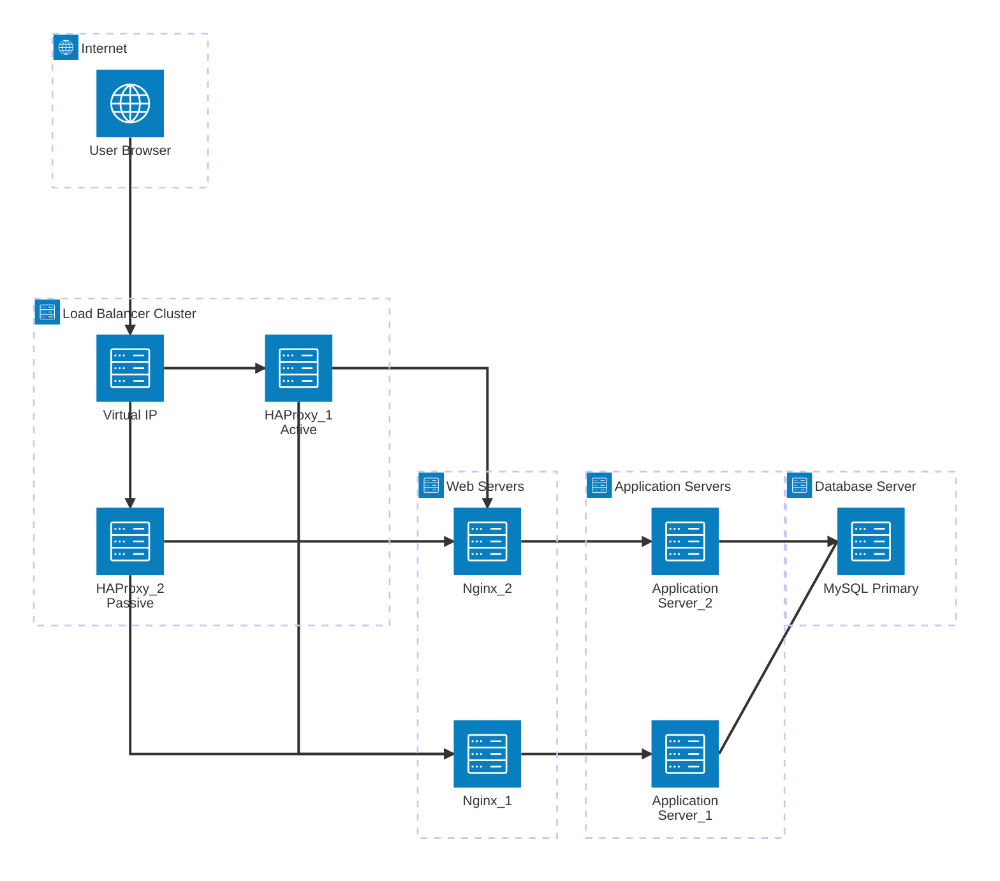

---
# Infrastructure overview

This infrastructure hosts the website www.foobar.com
using a highly available, secured, and scalable design composed of a load balancer cluster, web servers, application servers, and a database server.

## why each element is added
Load balancer cluster (HAProxy)
- The load balancer distributes incoming traffic across multiple web servers and provides high availability. It is configured as an Active–Passive cluster to avoid a single point of failure.

Virtual IP:
- A virtual IP is used as a single entry point for clients. It automatically moves between load balancer nodes in case of failure, ensuring uninterrupted access to the service.

Web servers (Nginx):
- Web servers handle HTTP connections and serve static content efficiently. They also act as a reverse proxy, forwarding requests to application servers.

Application servers:
- Application servers execute the business logic of the application. Separating them from the web servers allows independent scaling and improves security.

Database server (MySQL Primary):
- The database stores persistent application data. A single primary database handles write operations to maintain data consistency.

# What are firewalls for

- Firewalls restrict network access by allowing only authorized traffic between infrastructure components. They reduce the attack surface and prevent unauthorized access.

# Why traffic is served over HTTPS

- HTTPS encrypts data in transit using TLS, protecting sensitive information from interception and man-in-the-middle attacks. It also ensures data integrity and server authenticity.

# What monitoring is used for

Monitoring is used to:
- detect failures
- observe performance
- identify bottlenecks
- trigger alerts before users are impacted

# How monitoring data is collected

- Monitoring agents installed on each server collect metrics such as CPU usage, memory consumption, disk I/O, and application logs. This data is sent to a centralized monitoring system like Sumologic.

# How to monitor web server QPS

- To monitor web server QPS (queries per second), metrics can be collected from the web server access logs or exposed metrics endpoints and aggregated by the monitoring system.

# Issues with this infrastructure
- SSL termination at the load balancer
- Terminating SSL at the load balancer means traffic between the load balancer and backend servers is unencrypted, which can be a security risk if the internal network is compromised.
- Single MySQL server for writes
- Having only one database server capable of accepting writes creates a single point of failure and limits scalability.
- Servers containing all components
- Running web server, application server, and database on the same servers reduces isolation, complicates scaling, and increases the blast radius of failures.
